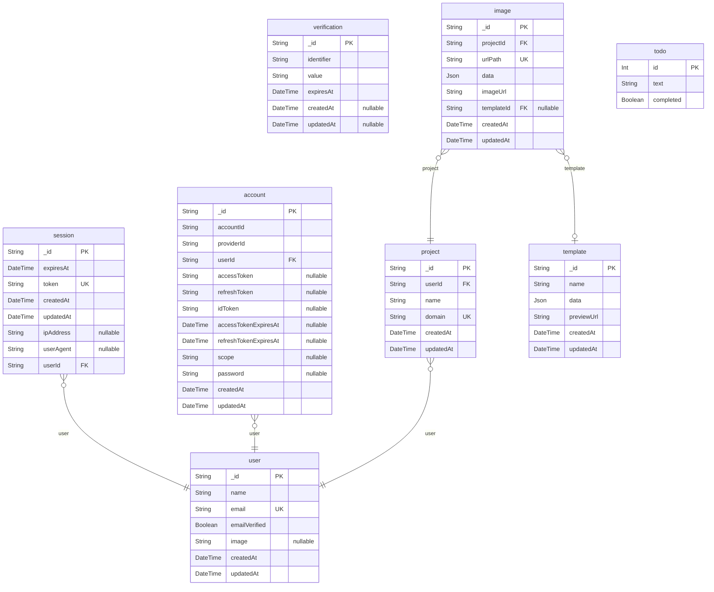

# Database Schema

> Generated by [`prisma-markdown`](https://github.com/samchon/prisma-markdown)

- [default](#default)

## default

### `user`

Properties as follows:

- `_id`:
- `name`:
- `email`:
- `emailVerified`:
- `image`:
- `createdAt`:
- `updatedAt`:

### `session`

Properties as follows:

- `_id`:
- `expiresAt`:
- `token`:
- `createdAt`:
- `updatedAt`:
- `ipAddress`:
- `userAgent`:
- `userId`:

### `account`

Properties as follows:

- `_id`:
- `accountId`:
- `providerId`:
- `userId`:
- `accessToken`:
- `refreshToken`:
- `idToken`:
- `accessTokenExpiresAt`:
- `refreshTokenExpiresAt`:
- `scope`:
- `password`:
- `createdAt`:
- `updatedAt`:

### `verification`

Properties as follows:

- `_id`:
- `identifier`:
- `value`:
- `expiresAt`:
- `createdAt`:
- `updatedAt`:

### `project`

Properties as follows:

- `_id`:
- `userId`:
- `name`:
- `domain`:
- `createdAt`:
- `updatedAt`:

### `template`

Properties as follows:

- `_id`:
- `name`:
- `data`:
- `previewUrl`:
- `createdAt`:
- `updatedAt`:

### `image`

Properties as follows:

- `_id`:
- `projectId`:
- `urlPath`:
- `data`:
- `imageUrl`:
- `templateId`:
- `createdAt`:
- `updatedAt`:

### `todo`

Properties as follows:

- `id`:
- `text`:
- `completed`:
